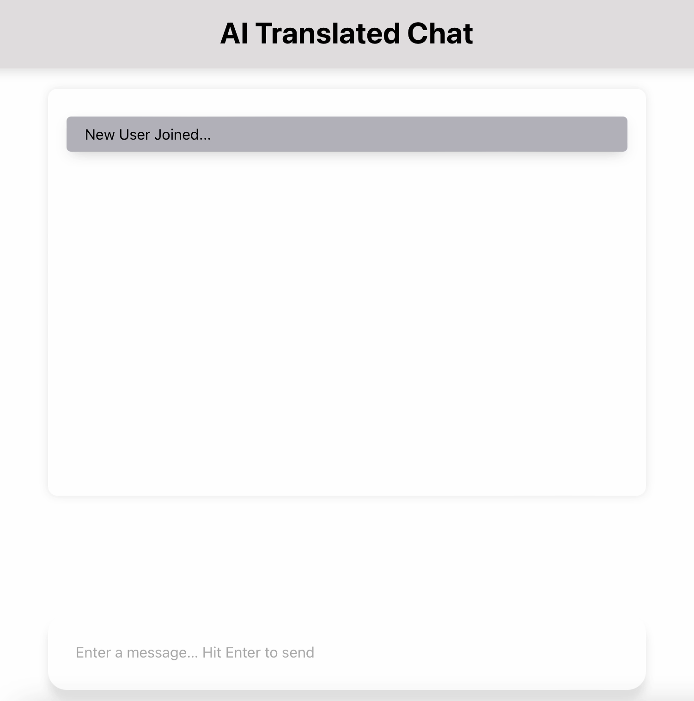
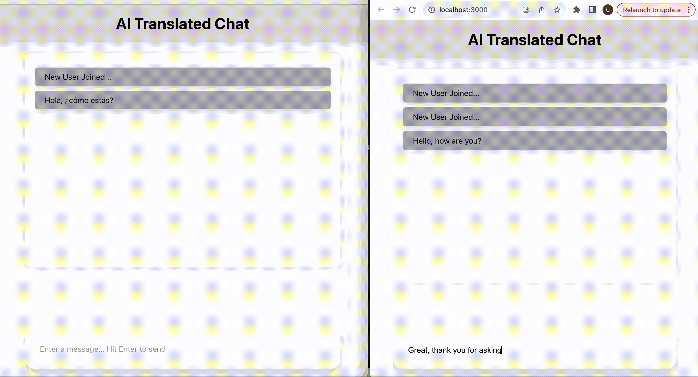
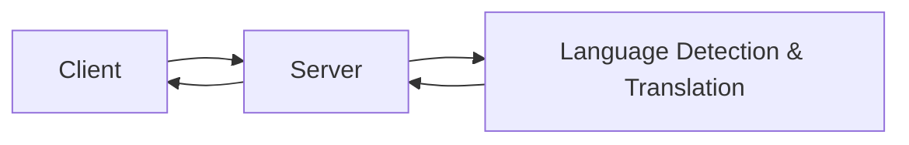

# Multilingual AI Chat


A real-time multilingual AI-powered chat application built with Go (backend) and React (frontend). The app detects user languages automatically and translates messages using OpenAI GPT models.

---

## Table of Contents

- [Features](#Features)
- [Screenshot & GIF](#Screenshot--GIF)
- [Tech Stack](#Tech-Stack)
- [Architecture](#Architecture)
- [Getting Started](#Getting-Started)
- [Backend Setup](#Backend-Setup)
- [Frontend Setup](#Frontend-Setup)
- [Usage](#Usage)
- [Folder Structure](#Folder-Structure)

---

## Features

- Real-time WebSocket chat communication.
- Automatic language detection for each user’s messages.
- AI-powered message translation per recipient.
- Modern, responsive UI built with React.
- Clear separation of backend and frontend logic for maintainability.

---

## Screenshot & GIF

### Chat UI


### Cross Language Communication


---

## Tech Stack

**Backend**:
- Go 1.21
- Gorilla WebSocket for real-time communication
- OpenAI GPT-3.5 API via Resty client

**Frontend**:
- React (JavaScript)
- SCSS for styling
- WebSocket API for real-time updates

---

## Architecture

**Flow**:
- Clients connect to Server via WebSocket.
- Backend detects the language of messages using GPT.
- Messages are translated to recipient’s language if needed.
- Messages are broadcasted to all connected clients.
- React frontend renders messages in real-time.

---

## Getting Started

**Backend Setup**
1. Clone the repository:
```bash
git clone https://github.com/cjr03/MultilingualChat-AI.git
cd MultilingualChat-AI/backend
```
2. Install Go dependencies:
```bash
go mod tidy
```
3. Add environment variables in .env:
```ini
OPENAI_API_KEY=your_openai_api_key_here
PORT=9000
```
4. Build frontend:
```bash
cd ../frontend
npm install
npm run build
```
5. Run the backend server:
```bash
cd ../backend
go run main.go
```
6. Your app will be available at:
```arduino
http://localhost:9000
```

**Frontend Setup**
1. Navigate to frontend folder:
```bash
cd frontend
```
2. Install dependencies:
```bash
npm install
```
3. Start the frontend development server:
```bash
npm start
```
- Runs on http://localhost:3000 by default.
- Connects automatically to backend WebSocket at the same host.

---

## Usage

- Open the frontend in a browser.
- Type a message in the input box and hit Enter.
- Messages are automatically detected and translated for other users.
- Real-time updates appear for all connected clients.

---

## Folder Structure

```plaintext
MultilingualChat-AI/
├─ backend/
│  ├─ main.go
│  ├─ go.mod
│  ├─ go.sum
│  ├─ pkg/
│  │  ├─ websocket/
│  │  │  ├─ client.go
│  │  │  ├─ pool.go
│  │  │  └─ websocket.go
│  │  └─ ai/
│  │     └─ gpt.go
│  └─ config/
│     └─ config.go
│                
├─ frontend/
│  ├─ public/
│  ├─ src/
│  │  ├─ api/
│  │  │  └─ index.js
│  │  ├─ components/
│  │  │  ├─ Header/
│  │  │  ├─ ChatHistory/
│  │  │  ├─ ChatInput/
│  │  │  └─ Message/
│  │  ├─ App.js
│  │  ├─ App.css
│  │  ├─ App.test.js
│  │  ├─ index.css
│  │  ├─ index.js
│  │  └─ reportWebVitals.js
│  └─ package.json
├─ .env
├─ docs/
│  ├─ start.png
│  └─ talk.gif
├─ README.md
└─ .gitignore
```

